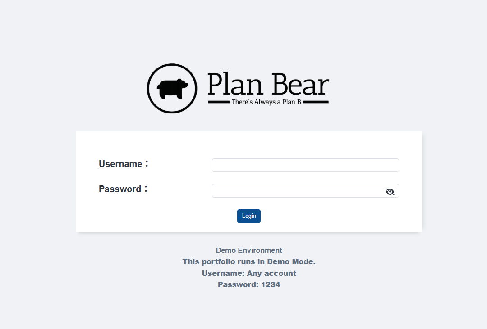
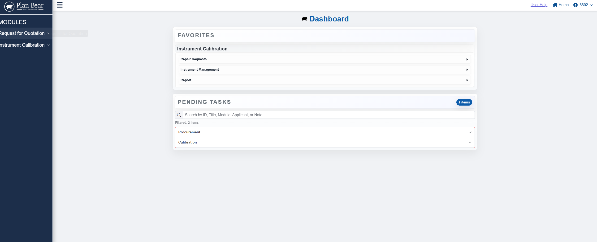

# 沈正龍 - Software Engineer

擁有三年金融業經驗，轉職軟體工程後，累積近兩年企業管理系統開發經驗。專注於使用 React、Next.js、Node.js、Express、PostgreSQL 與 SQL Server 建構企業應用，具備從需求分析、系統設計、RESTful API 開發、資料庫設計，到部署與維運的完整開發經驗。

曾獨立負責企業核心模組開發，熟悉 RFQ、Workflow、Instrument Calibration 與 CRM 等企業應用情境，並持續精進系統架構、程式碼品質與軟體設計實務。

📍 **新北市, 台灣**  
📝 **[方格子](https://vocus.cc/salon/666faabffd897800010a73bf)**  
📧 **[a86774546@gmail.com](mailto:a86774546@gmail.com)**

## Work Experience

### Software Engineer｜飛宏科技股份有限公司

- 獨立負責企業內部管理系統的完整開發生命週期，涵蓋需求分析、系統設計、前後端開發、部署及後續維運。
- 使用 **React、Next.js、Node.js、Express、PostgreSQL (Supabase)** 建置企業管理系統，開發 RESTful API、JWT 身分驗證、檔案上傳及排程通知等功能。
- 負責詢比價（RFQ）、儀器校驗（Calibration）等核心模組開發，並將既有系統逐步移轉至新平台，改善資料查詢、跨系統操作及流程處理效率。
- 開發與維護 BPM Workflow 簽核系統，使用 **C#、ASP.NET Web Forms** 製作及維護企業流程表單。
- 維護 CRM 客戶關係管理系統，處理問題排除及跨系統整合。
- 與採購、品保及使用單位協作，進行需求分析、功能設計及系統優化。

📅 **Sep 2024 - Present**

### 證券營業員｜富邦綜合證券股份有限公司

- 提供客戶投資與金融商品諮詢，建立並維護客戶關係。
- 培養需求分析、溝通協調及問題解決能力。

📅 **Sep 2020 - Apr 2024**

### 採購專員｜允晟照明股份有限公司

- 負責供應商管理、採購協調及成本控管。

📅 **Apr 2019 - Feb 2020**

### 業務專員｜大同大隈股份有限公司

- 進出口報關文件處理、商品盤點、顧客需求報價及簽約
- 追蹤物流進度

📅 **Mar 2017 - Dec 2018**

## Projects

### Enterprise Management System (Public Demo)

以實際企業專案為基礎重新設計的公開展示版本，採前後端分離架構，完整涵蓋 RFQ、Instrument Calibration、Equipment Repair、Workflow 等企業管理情境，並保留企業系統核心流程，同時完成去識別化與 Mock Data 重構，展示完整的全端開發能力。

**Key Features**

- RFQ Management｜詢比價管理
- Instrument Calibration｜儀器校驗管理
- Equipment Repair｜設備維修管理
- Workflow & Pending Tasks｜簽核流程與待辦事項
- Favorites｜常用功能
- Role-Based Access Control（RBAC）
- JWT Authentication
- File Upload & Management
- Background Jobs & Email Notifications

**Responsibilities**

- 獨立負責原企業管理系統的需求分析、系統設計、前後端開發、部署及後續維運。
- 以原系統為基礎，獨立完成公開 Demo 的去識別化、Mock Data 重構、功能調整及部署。
- 設計 RESTful API 與 PostgreSQL 資料庫 Schema。
- 實作 JWT 身分驗證與角色權限管理。
- 建立 Repository Pattern 架構，提高程式可維護性。
- 建置檔案上傳、背景排程及 Email 通知功能。

**Tech Stack**

- **Frontend:** React, Next.js, CoreUI, SCSS
- **Backend:** Node.js, Express.js
- **Database:** PostgreSQL（Supabase）
- **Authentication:** JWT
- **Storage:** Supabase Storage
- **Deployment:** Vercel, Render
- **Development & Tools:** Docker, Git, Postman

🔗 **Live Demo:** [View Demo](https://plan-bear-frontend-26nwvhmsd-a86774546-gmailcoms-projects.vercel.app/member/login)

> **Demo Account**  
> Username: Any username  
> Password: `1234`

🔗 **Frontend GitHub:** [Github](https://github.com/bearlong/PlanBear-Frontend)
🔗 **Backend GitHub:** [GitHub](https://github.com/bearlong/PlanBear-Backend)
🔗 **Medium:** [Enterprise Management System](https://reurl.cc/dOxKy6)

### 只欠東風麻將桌遊電商平台

四人協作開發的麻將桌遊電商平台，使用 React、Next.js、Node.js、Express 與 MySQL 建置商品、購物車、付款、訂單、客服及數據分析等功能。

**我負責的頁面:**

- 商品列表及詳細頁
- 購物車
- 付款流程金流串接
- 訂單列表及詳細頁
- 客服中心
- 數據分析
- 調整出貨狀況等頁面

**其他貢獻:**

- 串接第三方金流並完成付款流程。
- 整合團隊程式碼。
- 協助管理 Git Flow 與分支整合。
- 參與 RESTful API 規格制定與串接。
- 開發訂單出貨狀態管理功能。

**技術堆疊:**

- **前端:** CSS、Bootstrap、React、Next.js
- **後端及資料庫:** Express.js (with Node.js)、MySQL
- **套件:** Chart.js、Swiper.js、WebSocket

[GitHub](https://github.com/bearlong/EastWind)
[Medium](https://reurl.cc/eypOvQ)

### 只欠東風麻將桌遊專題 - 後台網站

六人協作開發的電商後台管理系統，使用 PHP、MySQL、JavaScript 與 Bootstrap，提供商品新增、修改、上下架及狀態管理功能。

**我主要負責的項目:**

- 開發商品新增、修改、上下架及狀態查詢功能。
- 製作後台導覽列。
- 協助整合團隊程式碼。

**技術堆疊:**

- **前端:** CSS、Bootstrap、JavaScript
- **後端及資料庫:** PHP、MySQL

[GitHub Repository](https://github.com/bearlong/mahjong)

### jQuery 飛機射擊小遊戲

使用 HTML、JavaScript 與 jQuery 製作的小型 Side Project，練習鍵盤事件、碰撞判定及遊戲迴圈。

**技術堆栈:**

- **前端:** CSS、JavaScript、jQuery

[GitHub Repository](https://github.com/bearlong/shootgame)

## Skills

### Front-end

- **Frameworks & Libraries:** React, Next.js
- **Languages:** JavaScript (ES6+), HTML5, CSS3, SCSS
- **UI Frameworks:** CoreUI, Bootstrap
- **Visualization:** Chart.js
- **Others:** Swiper.js

### Back-end

- **Languages & Frameworks:** Node.js, Express.js, C#, ASP.NET Web Forms
- **API Development:** RESTful API Design
- **Authentication:** JWT Authentication
- **File Handling:** Multer

### Database & Storage

- PostgreSQL
- SQL Server
- MySQL
- Supabase Database & Storage

### DevOps & Tools

- Git, GitHub, Git Flow
- Docker
- Vercel
- Render
- IIS
- Postman

### Architecture & Design

- Repository Pattern
- Layered Architecture
- Role-Based Access Control（RBAC）
- Database Schema Design
- RESTful API Architecture
- Background Jobs & Scheduled Tasks

## 學歷

### Soochow University

**財務工程與精算數學系**  
📅 **2011 - 2015**

## 其他專長

- **Financial Systems:** 嘉實證券系統、精業證券系統
- **Video Editing:** Adobe Premiere Pro, VEGAS Pro

## 證照

- 證券商高級業務員
- 期貨商業務員
- 投信投顧業務員
- 財富管理、金融商品及保險相關資格
